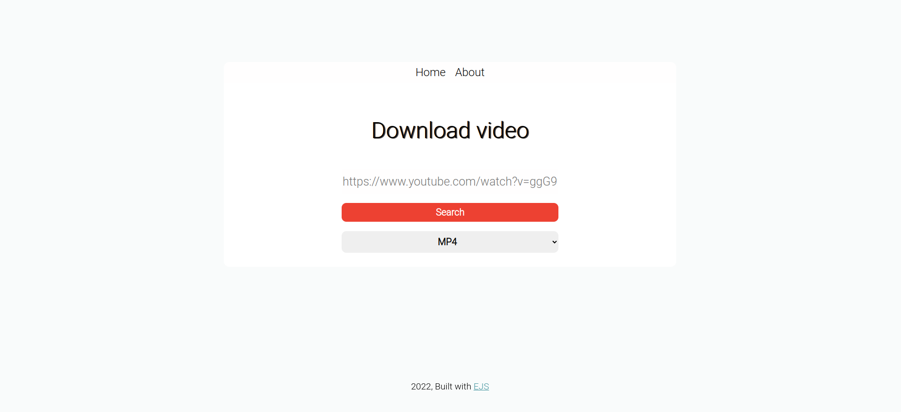

# Download video

### Built with
- [Node.js](https://nodejs.org/en/)
    - [ytdl-core](https://www.npmjs.com/package/ytdl-core)
- [CSS](https://developer.mozilla.org/en-US/docs/Web/CSS)
- [EJS](https://ejs.co/)

### How to use

Enter the terminal and type
````
git clone https://github.com/fredcardoso191/download-video.git
````

And then
````
cd download-video
````

Install project dependencies
````
npm install express --save
````
````
npm install body-parser --save
````
````
npm install ejs --save
````
````
npm install ytdl-core --save
````

To run the project, type
````
npm start
````

### Captured image
